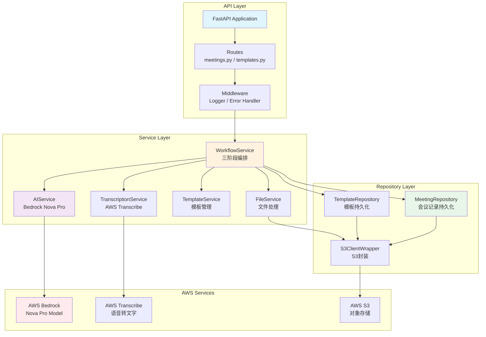
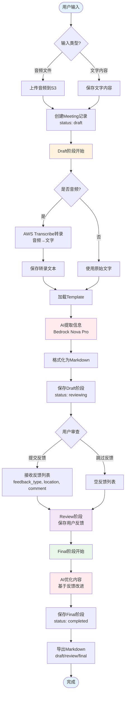
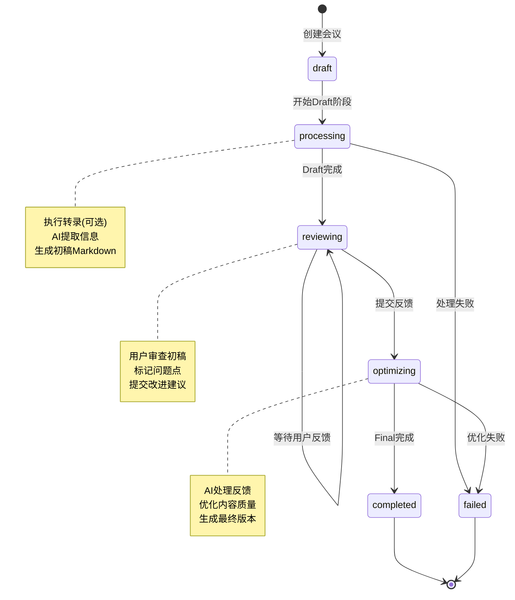

# AWS Bedrock Minutes

基于AWS Bedrock Nova Pro的AI会议记录生成系统，采用三阶段工作流(制作-审查-优化)自动生成高质量会议记录。

## 项目简介

AWS Bedrock Minutes是一个智能会议记录生成工具，能够从音频录音或文字记录中自动提取关键信息并按模板格式化输出。系统采用三阶段工作流确保输出质量:

1. **制作阶段 (Draft)**: AI自动转录音频并生成初始会议记录
2. **审查阶段 (Review)**: 用户审阅并标记需要改进的部分
3. **优化阶段 (Final)**: AI根据反馈优化内容生成最终版本

## 核心功能

- **多种输入方式**: 支持音频文件(MP3/WAV/MP4)或直接输入文字
- **智能提取**: 自动识别会议主题、参与者、讨论议题、决策事项和行动项
- **模板系统**: 提供默认模板并支持自定义模板
- **三阶段工作流**: 确保会议记录的准确性和完整性
- **版本管理**: 保留所有阶段的版本历史
- **Markdown导出**: 支持导出为标准Markdown格式

## 技术栈

### 后端
- **语言**: Python 3.11+
- **Web框架**: FastAPI (异步API)
- **AI服务**: AWS Bedrock (Nova Pro模型)
- **语音转文字**: AWS Transcribe
- **存储**: AWS S3
- **数据验证**: Pydantic
- **测试框架**: pytest
- **代码质量**: ruff

### 前端
- **框架**: Vue 3 (Composition API)
- **构建工具**: Vite
- **UI库**: Tailwind CSS
- **路由**: Vue Router 4
- **HTTP客户端**: Axios
- **Markdown渲染**: markdown-it

## 快速开始

### 前置条件

- Python 3.11+ 已安装
- Node.js 18+ 和 npm 已安装
- AWS账号并配置以下服务权限:
  - Amazon Bedrock (Nova Pro模型访问)
  - Amazon Transcribe
  - Amazon S3

### 后端安装

```bash
# 克隆仓库(如果需要)
cd AWS-Bedrock-Mintues

# 创建虚拟环境
python -m venv venv
source venv/bin/activate  # Windows: venv\Scripts\activate

# 安装依赖
pip install -r requirements.txt
pip install -r requirements-dev.txt

# 配置环境变量
cp .env.example .env
# 编辑.env文件填写AWS凭证

# 创建 S3 存储桶
aws s3 mb s3://your-bucket-name --region us-east-1
```

### 前端安装

```bash
# 进入前端目录
cd frontend

# 安装依赖
npm install

# 配置环境变量（可选，默认连接 localhost:8000）
echo "VITE_API_BASE_URL=http://localhost:8000" > .env
```

### 环境变量配置

编辑`.env`文件,配置以下必需参数:

```env
# AWS配置
AWS_REGION=us-east-1
AWS_ACCESS_KEY_ID=your_access_key_here
AWS_SECRET_ACCESS_KEY=your_secret_key_here

# S3存储
S3_BUCKET_NAME=meeting-minutes-dev

# Bedrock模型
BEDROCK_MODEL_ID=amazon.nova-pro-v1:0

# Transcribe配置
TRANSCRIBE_LANGUAGE_CODE=zh-CN

# API配置
API_HOST=0.0.0.0
API_PORT=8000
```

### 启动服务

#### 启动后端 API

```bash
uvicorn src.api.main:app --reload
```

访问 [http://localhost:8000/docs](http://localhost:8000/docs) 查看交互式API文档

#### 启动前端 Web UI

```bash
cd frontend
npm run dev
```

访问 [http://localhost:5173](http://localhost:5173) 使用 Web 界面

## 使用示例

### 场景 0: 使用 Web 界面（推荐）

1. **启动后端和前端服务**（参见上方"启动服务"部分）
2. **打开浏览器访问** [http://localhost:5173](http://localhost:5173)
3. **创建会议**:
   - 选择"文字输入"或"音频上传"
   - 输入会议内容或上传音频文件
   - 点击"开始生成会议记录"
4. **等待 Draft 生成**（自动跳转到详情页面）
5. **审查并提交反馈**:
   - 查看 AI 生成的初稿
   - 添加反馈（章节名称 + 行号 + 具体说明）
   - 点击"提交反馈并优化"
6. **查看最终结果**:
   - 切换 Draft/Final 版本对比
   - 下载 Markdown 文件

---

### 场景 1: 使用 API - 从音频生成会议记录

**步骤1: 上传音频文件**

```bash
curl -X POST http://localhost:8000/api/v1/meetings \
  -F "input_type=audio" \
  -F "audio_file=@meeting_recording.mp3"
```

**响应**:
```json
{
  "id": "123e4567-e89b-12d3-a456-426614174000",
  "status": "draft",
  "created_at": "2025-10-01T10:00:00Z",
  "estimated_completion_time": 180
}
```

**步骤2: 轮询状态**

```bash
meeting_id="123e4567-e89b-12d3-a456-426614174000"

# 查询会议状态
curl http://localhost:8000/api/v1/meetings/$meeting_id
```

**步骤3: 提交审查反馈**

```bash
curl -X POST http://localhost:8000/api/v1/meetings/$meeting_id/feedback \
  -H "Content-Type: application/json" \
  -d '{
    "feedbacks": [
      {
        "feedback_type": "inaccurate",
        "location": "section:决策事项,line:1",
        "comment": "应该是优先开发推荐功能,不是AI功能"
      }
    ]
  }'
```

**步骤4: 导出最终版本**

```bash
curl http://localhost:8000/api/v1/meetings/$meeting_id/export?stage=final \
  -o meeting_minutes_final.md
```

### 场景 2: 使用 API - 从文字生成会议记录

```bash
curl -X POST http://localhost:8000/api/v1/meetings \
  -F "input_type=text" \
  -F "text_content=今天会议讨论了三个主要议题...
发言人A: 我认为应该优先...
发言人B: 我同意,但是..."
```

## 项目架构

### 系统架构图

系统采用分层架构设计，遵循SOLID原则和关注点分离：



### 三阶段数据流程图

详细展示从输入到最终输出的完整数据流：



### 三阶段工作流状态机



### S3存储架构

```
s3://meeting-minutes-dev/
├── audio/                    # 原始音频文件
│   └── {meeting_id}.mp3
├── transcripts/              # 转录文本
│   └── {meeting_id}.txt
├── meetings/                 # 会议记录JSON
│   └── {meeting_id}.json
└── templates/                # 模板定义
    ├── default.json
    └── custom/{template_id}.json
```

### 目录结构

```
AWS-Bedrock-Mintues/
├── frontend/               # 前端 Vue 应用
│   ├── src/
│   │   ├── api/           # API 调用封装
│   │   ├── views/         # 页面组件
│   │   ├── router/        # 路由配置
│   │   ├── App.vue        # 根组件
│   │   └── main.js        # 入口文件
│   ├── package.json
│   └── vite.config.js
├── src/                   # 后端 Python 应用
│   ├── api/              # FastAPI应用
│   │   ├── main.py       # 应用入口
│   │   ├── routes/       # API路由
│   │   │   ├── meetings.py  # 会议记录端点
│   │   │   └── templates.py # 模板管理端点
│   │   ├── middleware/   # 中间件
│   │   └── dependencies.py  # 依赖注入
│   ├── models/           # 数据模型
│   │   ├── meeting.py    # 会议记录模型（UserFeedback 单一定义）
│   │   ├── template.py   # 模板模型
│   │   └── feedback.py   # 反馈输入模型
│   ├── services/         # 业务逻辑
│   │   ├── workflow_service.py    # 工作流编排
│   │   ├── transcription_service.py # 转录服务
│   │   ├── ai_service.py          # AI处理服务
│   │   └── file_service.py        # 文件处理服务
│   ├── storage/          # 数据访问层
│   │   ├── s3_client.py  # S3客户端封装
│   │   ├── meeting_repository.py  # 会议记录仓库
│   │   └── template_repository.py # 模板仓库
│   ├── cli/              # 命令行工具
│   │   └── init_defaults.py # 初始化默认模板
│   └── config.py         # 配置管理
├── tests/                # 测试套件
│   ├── unit/            # 单元测试
│   ├── integration/     # 集成测试
│   └── contract/        # 契约测试
├── prompts/             # AI提示词模板
├── .env.example         # 环境变量示例
├── requirements.txt     # 生产依赖
├── requirements-dev.txt # 开发依赖
├── pyproject.toml       # 项目配置
├── CLAUDE.md            # Claude Code 项目指南
└── README.md            # 本文件
```

## 开发指南

### 后端开发

#### 运行测试

```bash
# 运行所有测试
pytest

# 运行特定类型的测试
pytest tests/unit/ -m unit
pytest tests/integration/ -m integration
pytest tests/contract/ -m contract

# 生成覆盖率报告
pytest --cov=src --cov-report=html
open htmlcov/index.html
```

#### 代码质量检查

```bash
# 使用ruff检查代码
ruff check src/ tests/

# 自动格式化代码
ruff format src/ tests/
```

### 前端开发

#### 开发模式

```bash
cd frontend
npm run dev
```

访问 http://localhost:5173 查看实时预览（支持热重载）

#### 生产构建

```bash
cd frontend
npm run build
```

构建产物在 `frontend/dist/` 目录

#### 前端特性

- ✅ **三阶段可视化进度条**：清晰展示 Draft → Review → Final 流程
- ✅ **实时状态轮询**：每 5 秒自动更新会议状态
- ✅ **结构化反馈输入**：章节 + 行号自动拼接为正确格式
- ✅ **Markdown 渲染预览**：实时预览会议记录
- ✅ **版本对比功能**：Draft/Final 版本一键切换
- ✅ **拖拽上传**：支持拖拽音频文件上传
- ✅ **响应式设计**：适配桌面和移动端

### 开发流程

本项目遵循TDD(测试驱动开发)流程:

1. **编写契约测试**: 定义接口契约
2. **编写单元测试**: 测试单个组件
3. **实现功能**: 使测试通过
4. **编写集成测试**: 验证组件协作
5. **重构**: 改进代码质量

### 项目宪法原则

- **KISS** (Keep It Simple, Stupid): 避免过度设计
- **YAGNI** (You Aren't Gonna Need It): 只实现当前需要的功能
- **SOLID原则**: 编写可维护的面向对象代码
- **无技术债务**: 不使用硬编码，不留待办事项
- **SOTA方法**: 采用最新的最佳实践
- **单一数据源**: UserFeedback 仅在 meeting.py 定义，避免类型混淆

## 部署指南

### 生产环境部署架构

```
用户浏览器
    ↓
前端静态文件 (Nginx/S3/Vercel)
    ↓
后端 API (EC2/Lambda/ECS)
    ↓
AWS Services (Bedrock/Transcribe/S3)
```

### 前端部署

#### 选项 1: 与后端一起部署（推荐用于简单场景）

```bash
# 1. 构建前端
cd frontend
npm run build

# 2. 将构建产物复制到后端静态目录
mkdir -p ../static
cp -r dist/* ../static/

# 3. 配置 FastAPI 服务静态文件
# 在 src/api/main.py 添加:
# from fastapi.staticfiles import StaticFiles
# app.mount("/", StaticFiles(directory="static", html=True), name="static")
```

#### 选项 2: 单独部署前端（推荐用于生产）

**Vercel 部署**:
```bash
cd frontend
npm run build
vercel --prod
```

**Nginx 部署**:
```bash
# 构建
cd frontend
npm run build

# 配置 Nginx
sudo nano /etc/nginx/sites-available/bedrock-minutes

# Nginx 配置示例
server {
    listen 80;
    server_name your-domain.com;
    root /var/www/bedrock-minutes;
    index index.html;

    location / {
        try_files $uri $uri/ /index.html;
    }

    location /api/ {
        proxy_pass http://localhost:8000;
        proxy_set_header Host $host;
    }
}
```

### 后端部署

#### AWS Lambda部署

```bash
# 打包依赖
pip install -r requirements.txt -t package/
cd package
zip -r ../deployment.zip .
cd ..
zip -g deployment.zip src/

# 上传到Lambda
aws lambda create-function \
  --function-name bedrock-minutes-api \
  --runtime python3.11 \
  --handler src.api.main.app \
  --role arn:aws:iam::ACCOUNT:role/lambda-role \
  --zip-file fileb://deployment.zip
```

### EC2部署

```bash
# 使用systemd管理服务
sudo nano /etc/systemd/system/bedrock-minutes.service

# 服务配置
[Unit]
Description=AWS Bedrock Minutes API
After=network.target

[Service]
User=ubuntu
WorkingDirectory=/home/ubuntu/AWS-Bedrock-Mintues
Environment="PATH=/home/ubuntu/AWS-Bedrock-Mintues/venv/bin"
ExecStart=/home/ubuntu/AWS-Bedrock-Mintues/venv/bin/uvicorn src.api.main:app --host 0.0.0.0 --port 8000

[Install]
WantedBy=multi-user.target

# 启动服务
sudo systemctl enable bedrock-minutes
sudo systemctl start bedrock-minutes
```

### 环境变量最佳实践

- 生产环境使用AWS Secrets Manager或Parameter Store
- 不要在代码中硬编码凭证
- 为不同环境使用不同的配置文件

## 成本估算

基于1小时音频会议的典型成本(2025年定价):

- **AWS Transcribe**: ~$0.024/分钟 × 60 = $1.44
- **AWS Bedrock (Nova Pro)**: ~$0.02/1K tokens × 平均5K tokens = $0.10
- **AWS S3**: ~$0.023/GB × 0.1GB = $0.002
- **总计**: 约 **$1.50/会议**

注: 实际成本可能因音频质量、会议内容复杂度和优化次数而变化。

## 故障排查

### 问题1: AWS权限错误

```
ClientError: An error occurred (AccessDeniedException) when calling Bedrock
```

**解决方案**: 确保IAM角色具有以下权限:
- `bedrock:InvokeModel`
- `transcribe:StartTranscriptionJob`
- `transcribe:GetTranscriptionJob`
- `s3:PutObject`, `s3:GetObject`

### 问题2: 音频文件过大

```
HTTP 413: Payload Too Large
```

**解决方案**:
- 压缩音频文件(建议64kbps比特率)
- 分段处理长会议

### 问题3: 处理超时

```
Status: processing (持续超过10分钟)
```

**解决方案**:
1. 检查AWS服务配额
2. 查看日志: `tail -f logs/app.log`
3. 检查Bedrock或Transcribe服务状态

## 贡献指南

欢迎贡献! 请遵循以下流程:

1. Fork本仓库
2. 创建功能分支: `git checkout -b feature/your-feature`
3. 编写测试并确保通过
4. 提交更改: `git commit -m "Add your feature"`
5. 推送到分支: `git push origin feature/your-feature`
6. 创建Pull Request

### 代码审查标准

- 所有测试必须通过(覆盖率>90%)
- 代码必须通过ruff检查
- 遵循项目宪法原则
- 更新相关文档

## API文档

访问 [http://localhost:8000/docs](http://localhost:8000/docs) 查看完整的交互式API文档(Swagger UI)

或访问 [http://localhost:8000/redoc](http://localhost:8000/redoc) 查看ReDoc格式文档

详细的API使用说明请参阅: [docs/API.md](docs/API.md)

## License

MIT License - 详见LICENSE文件

## 联系方式

- 项目维护者: [Your Name]
- 问题反馈: [GitHub Issues](https://github.com/your-org/AWS-Bedrock-Mintues/issues)
- 详细规范: `/specs/001-ai/`

## 致谢

- AWS Bedrock团队提供的强大AI能力
- FastAPI框架的优秀设计
- 开源社区的支持

---

**更新时间**: 2025-10-02
**版本**: 2.0.0
**更新内容**:
- ✅ 新增 Vue 3 前端 Web 界面
- ✅ 三阶段可视化进度追踪
- ✅ 结构化反馈输入系统
- ✅ Draft/Final 版本对比功能
- ✅ 统一 UserFeedback 数据模型（零技术债务）
- ✅ 完善的错误处理和用户提示
