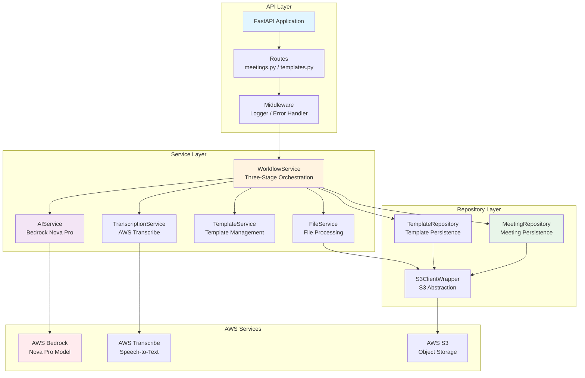
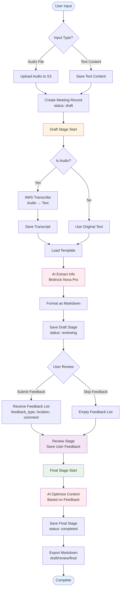
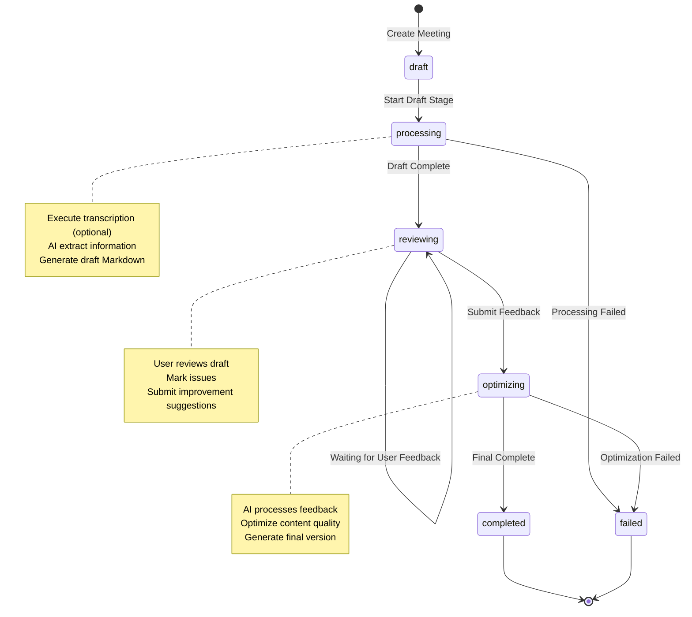

# AWS Bedrock Minutes

AI-powered meeting minutes generation system based on AWS Bedrock Nova Pro, featuring a three-stage workflow (Draft-Review-Final) to automatically generate high-quality meeting minutes.

[中文文档](./README-CN.md)

## Overview

AWS Bedrock Minutes is an intelligent meeting minutes generator that automatically extracts key information from audio recordings or text transcripts and formats them using templates. The system employs a three-stage workflow to ensure output quality:

1. **Draft Stage**: AI automatically transcribes audio and generates initial meeting minutes
2. **Review Stage**: Users review and mark areas for improvement
3. **Final Stage**: AI optimizes content based on feedback to generate the final version

## Key Features

- **Multiple Input Methods**: Supports audio files (MP3/WAV/MP4) or direct text input
- **Smart Extraction**: Automatically identifies meeting topics, participants, discussion items, decisions, and action items
- **Template System**: Provides default templates with support for custom templates
- **Three-Stage Workflow**: Ensures accuracy and completeness of meeting minutes
- **Version Management**: Preserves version history across all stages
- **Markdown Export**: Supports export in standard Markdown format

## Tech Stack

### Backend
- **Language**: Python 3.11+
- **Web Framework**: FastAPI (Async API)
- **AI Service**: AWS Bedrock (Nova Pro Model)
- **Speech-to-Text**: AWS Transcribe
- **Storage**: AWS S3
- **Data Validation**: Pydantic
- **Testing Framework**: pytest
- **Code Quality**: ruff

### Frontend
- **Framework**: Vue 3 (Composition API)
- **Build Tool**: Vite
- **UI Library**: Tailwind CSS
- **Routing**: Vue Router 4
- **HTTP Client**: Axios
- **Markdown Rendering**: markdown-it

## Quick Start

### Prerequisites

- Python 3.11+ installed
- Node.js 18+ and npm installed
- AWS account with permissions for:
  - Amazon Bedrock (Nova Pro model access)
  - Amazon Transcribe
  - Amazon S3

### Backend Installation

```bash
# Clone the repository (if needed)
cd AWS-Bedrock-Mintues

# Create virtual environment
python -m venv venv
source venv/bin/activate  # Windows: venv\Scripts\activate

# Install dependencies
pip install -r requirements.txt
pip install -r requirements-dev.txt

# Configure environment variables
cp .env.example .env
# Edit .env file with your AWS credentials

# Create S3 bucket
aws s3 mb s3://your-bucket-name --region us-east-1
```

### Frontend Installation

```bash
# Navigate to frontend directory
cd frontend

# Install dependencies
npm install

# Configure environment variables (optional, defaults to localhost:8000)
echo "VITE_API_BASE_URL=http://localhost:8000" > .env
```

### Environment Configuration

Edit the `.env` file with the following required parameters:

```env
# AWS Configuration
AWS_REGION=us-east-1
AWS_ACCESS_KEY_ID=your_access_key_here
AWS_SECRET_ACCESS_KEY=your_secret_key_here

# S3 Storage
S3_BUCKET_NAME=meeting-minutes-dev

# Bedrock Model
BEDROCK_MODEL_ID=amazon.nova-pro-v1:0

# Transcribe Configuration
TRANSCRIBE_LANGUAGE_CODE=zh-CN

# API Configuration
API_HOST=0.0.0.0
API_PORT=8000
```

### Start Services

#### Start Backend API

```bash
uvicorn src.api.main:app --reload
```

Visit [http://localhost:8000/docs](http://localhost:8000/docs) for interactive API documentation

#### Start Frontend Web UI

```bash
cd frontend
npm run dev
```

Visit [http://localhost:5173](http://localhost:5173) to use the web interface

## Usage Examples

### Scenario 0: Using Web Interface (Recommended)

1. **Start backend and frontend services** (see "Start Services" above)
2. **Open browser and visit** [http://localhost:5173](http://localhost:5173)
3. **Create Meeting**:
   - Select "Text Input" or "Audio Upload"
   - Enter meeting content or upload audio file
   - Click "Start Generating Meeting Minutes"
4. **Wait for Draft Generation** (automatically redirects to details page)
5. **Review and Submit Feedback**:
   - Review AI-generated draft
   - Add feedback (section name + line number + description)
   - Click "Submit Feedback and Optimize"
6. **View Final Results**:
   - Toggle between Draft/Final versions
   - Download Markdown file

---

### Scenario 1: Using API - Generate from Audio

**Step 1: Upload Audio File**

```bash
curl -X POST http://localhost:8000/api/v1/meetings \
  -F "input_type=audio" \
  -F "audio_file=@meeting_recording.mp3"
```

**Response**:
```json
{
  "id": "123e4567-e89b-12d3-a456-426614174000",
  "status": "draft",
  "created_at": "2025-10-01T10:00:00Z",
  "estimated_completion_time": 180
}
```

**Step 2: Poll Status**

```bash
meeting_id="123e4567-e89b-12d3-a456-426614174000"

# Query meeting status
curl http://localhost:8000/api/v1/meetings/$meeting_id
```

**Step 3: Submit Review Feedback**

```bash
curl -X POST http://localhost:8000/api/v1/meetings/$meeting_id/feedback \
  -H "Content-Type: application/json" \
  -d '{
    "feedbacks": [
      {
        "feedback_type": "inaccurate",
        "location": "section:Decisions,line:1",
        "comment": "Should prioritize recommendation feature, not AI feature"
      }
    ]
  }'
```

**Step 4: Export Final Version**

```bash
curl http://localhost:8000/api/v1/meetings/$meeting_id/export?stage=final \
  -o meeting_minutes_final.md
```

### Scenario 2: Using API - Generate from Text

```bash
curl -X POST http://localhost:8000/api/v1/meetings \
  -F "input_type=text" \
  -F "text_content=Today's meeting discussed three main topics...
Speaker A: I think we should prioritize...
Speaker B: I agree, but..."
```

## Architecture

### System Architecture

The system adopts a layered architecture design following SOLID principles and separation of concerns:



### Three-Stage Data Flow

Detailed visualization of the complete data flow from input to final output:



### Three-Stage Workflow State Machine



### S3 Storage Architecture

```
s3://meeting-minutes-dev/
├── audio/                    # Original audio files
│   └── {meeting_id}.mp3
├── transcripts/              # Transcription texts
│   └── {meeting_id}.txt
├── meetings/                 # Meeting record JSON
│   └── {meeting_id}.json
└── templates/                # Template definitions
    ├── default.json
    └── custom/{template_id}.json
```

### Directory Structure

```
AWS-Bedrock-Mintues/
├── frontend/               # Frontend Vue application
│   ├── src/
│   │   ├── api/           # API call wrappers
│   │   ├── views/         # Page components
│   │   ├── router/        # Router configuration
│   │   ├── App.vue        # Root component
│   │   └── main.js        # Entry file
│   ├── package.json
│   └── vite.config.js
├── src/                   # Backend Python application
│   ├── api/              # FastAPI application
│   │   ├── main.py       # Application entry point
│   │   ├── routes/       # API routes
│   │   │   ├── meetings.py  # Meeting endpoints
│   │   │   └── templates.py # Template endpoints
│   │   ├── middleware/   # Middleware
│   │   └── dependencies.py  # Dependency injection
│   ├── models/           # Data models
│   │   ├── meeting.py    # Meeting model (UserFeedback single source of truth)
│   │   ├── template.py   # Template model
│   │   └── feedback.py   # Feedback input model
│   ├── services/         # Business logic
│   │   ├── workflow_service.py    # Workflow orchestration
│   │   ├── transcription_service.py # Transcription service
│   │   ├── ai_service.py          # AI processing service
│   │   └── file_service.py        # File processing service
│   ├── storage/          # Data access layer
│   │   ├── s3_client.py  # S3 client wrapper
│   │   ├── meeting_repository.py  # Meeting repository
│   │   └── template_repository.py # Template repository
│   ├── cli/              # CLI tools
│   │   └── init_defaults.py # Initialize default templates
│   └── config.py         # Configuration management
├── tests/                # Test suite
│   ├── unit/            # Unit tests
│   ├── integration/     # Integration tests
│   └── contract/        # Contract tests
├── prompts/             # AI prompt templates
├── .env.example         # Environment variables example
├── requirements.txt     # Production dependencies
├── requirements-dev.txt # Development dependencies
├── pyproject.toml       # Project configuration
├── CLAUDE.md            # Claude Code project guide
└── README.md            # This file
```

## Development Guide

### Backend Development

#### Running Tests

```bash
# Run all tests
pytest

# Run specific test types
pytest tests/unit/ -m unit
pytest tests/integration/ -m integration
pytest tests/contract/ -m contract

# Generate coverage report
pytest --cov=src --cov-report=html
open htmlcov/index.html
```

#### Code Quality Checks

```bash
# Check code with ruff
ruff check src/ tests/

# Auto-format code
ruff format src/ tests/
```

### Frontend Development

#### Development Mode

```bash
cd frontend
npm run dev
```

Visit http://localhost:5173 for live preview (with hot reload)

#### Production Build

```bash
cd frontend
npm run build
```

Build artifacts will be in the `frontend/dist/` directory

#### Frontend Features

- ✅ **Three-Stage Visual Progress Bar**: Clearly displays Draft → Review → Final flow
- ✅ **Real-time Status Polling**: Auto-updates meeting status every 5 seconds
- ✅ **Structured Feedback Input**: Section + line number auto-concatenated to correct format
- ✅ **Markdown Rendering Preview**: Real-time preview of meeting minutes
- ✅ **Version Comparison**: One-click toggle between Draft/Final versions
- ✅ **Drag-and-Drop Upload**: Support drag-and-drop audio file upload
- ✅ **Responsive Design**: Adapts to desktop and mobile devices

### Development Workflow

This project follows TDD (Test-Driven Development):

1. **Write Contract Tests**: Define interface contracts
2. **Write Unit Tests**: Test individual components
3. **Implement Features**: Make tests pass
4. **Write Integration Tests**: Verify component collaboration
5. **Refactor**: Improve code quality

### Project Constitution Principles

- **KISS** (Keep It Simple, Stupid): Avoid over-engineering
- **YAGNI** (You Aren't Gonna Need It): Only implement what's currently needed
- **SOLID Principles**: Write maintainable object-oriented code
- **Zero Technical Debt**: No hardcoding, no TODO items left behind
- **SOTA Methods**: Adopt latest best practices
- **Single Source of Truth**: UserFeedback only defined in meeting.py to avoid type confusion

## Deployment Guide

### Production Environment Architecture

```
User Browser
    ↓
Frontend Static Files (Nginx/S3/Vercel)
    ↓
Backend API (EC2/Lambda/ECS)
    ↓
AWS Services (Bedrock/Transcribe/S3)
```

### Frontend Deployment

#### Option 1: Deploy with Backend (Recommended for simple scenarios)

```bash
# 1. Build frontend
cd frontend
npm run build

# 2. Copy build artifacts to backend static directory
mkdir -p ../static
cp -r dist/* ../static/

# 3. Configure FastAPI to serve static files
# Add to src/api/main.py:
# from fastapi.staticfiles import StaticFiles
# app.mount("/", StaticFiles(directory="static", html=True), name="static")
```

#### Option 2: Deploy Frontend Separately (Recommended for production)

**Vercel Deployment**:
```bash
cd frontend
npm run build
vercel --prod
```

**Nginx Deployment**:
```bash
# Build
cd frontend
npm run build

# Configure Nginx
sudo nano /etc/nginx/sites-available/bedrock-minutes

# Nginx configuration example
server {
    listen 80;
    server_name your-domain.com;
    root /var/www/bedrock-minutes;
    index index.html;

    location / {
        try_files $uri $uri/ /index.html;
    }

    location /api/ {
        proxy_pass http://localhost:8000;
        proxy_set_header Host $host;
    }
}
```

### Backend Deployment

#### AWS Lambda Deployment

```bash
# Package dependencies
pip install -r requirements.txt -t package/
cd package
zip -r ../deployment.zip .
cd ..
zip -g deployment.zip src/

# Upload to Lambda
aws lambda create-function \
  --function-name bedrock-minutes-api \
  --runtime python3.11 \
  --handler src.api.main.app \
  --role arn:aws:iam::ACCOUNT:role/lambda-role \
  --zip-file fileb://deployment.zip
```

#### EC2 Deployment

```bash
# Use systemd to manage service
sudo nano /etc/systemd/system/bedrock-minutes.service

# Service configuration
[Unit]
Description=AWS Bedrock Minutes API
After=network.target

[Service]
User=ubuntu
WorkingDirectory=/home/ubuntu/AWS-Bedrock-Mintues
Environment="PATH=/home/ubuntu/AWS-Bedrock-Mintues/venv/bin"
ExecStart=/home/ubuntu/AWS-Bedrock-Mintues/venv/bin/uvicorn src.api.main:app --host 0.0.0.0 --port 8000

[Install]
WantedBy=multi-user.target

# Start service
sudo systemctl enable bedrock-minutes
sudo systemctl start bedrock-minutes
```

### Environment Variables Best Practices

- Use AWS Secrets Manager or Parameter Store in production
- Never hardcode credentials in code
- Use different configuration files for different environments

## Cost Estimation

Typical cost for a 1-hour audio meeting (2025 pricing):

- **AWS Transcribe**: ~$0.024/minute × 60 = $1.44
- **AWS Bedrock (Nova Pro)**: ~$0.02/1K tokens × average 5K tokens = $0.10
- **AWS S3**: ~$0.023/GB × 0.1GB = $0.002
- **Total**: Approximately **$1.50/meeting**

Note: Actual costs may vary based on audio quality, meeting content complexity, and number of optimizations.

## Troubleshooting

### Issue 1: AWS Permission Errors

```
ClientError: An error occurred (AccessDeniedException) when calling Bedrock
```

**Solution**: Ensure IAM role has the following permissions:
- `bedrock:InvokeModel`
- `transcribe:StartTranscriptionJob`
- `transcribe:GetTranscriptionJob`
- `s3:PutObject`, `s3:GetObject`

### Issue 2: Audio File Too Large

```
HTTP 413: Payload Too Large
```

**Solution**:
- Compress audio file (recommended 64kbps bitrate)
- Process long meetings in segments

### Issue 3: Processing Timeout

```
Status: processing (continues for more than 10 minutes)
```

**Solution**:
1. Check AWS service quotas
2. View logs: `tail -f logs/app.log`
3. Check Bedrock or Transcribe service status

## Contributing

Contributions are welcome! Please follow this workflow:

1. Fork this repository
2. Create feature branch: `git checkout -b feature/your-feature`
3. Write tests and ensure they pass
4. Commit changes: `git commit -m "Add your feature"`
5. Push to branch: `git push origin feature/your-feature`
6. Create Pull Request

### Code Review Standards

- All tests must pass (coverage >90%)
- Code must pass ruff checks
- Follow project constitution principles
- Update relevant documentation

## API Documentation

Visit [http://localhost:8000/docs](http://localhost:8000/docs) for complete interactive API documentation (Swagger UI)

Or visit [http://localhost:8000/redoc](http://localhost:8000/redoc) for ReDoc format documentation

For detailed API usage, see: [docs/API.md](docs/API.md)

## License

MIT License - See LICENSE file for details

## Contact

- Project Maintainer: [Your Name]
- Issue Reporting: [GitHub Issues](https://github.com/your-org/AWS-Bedrock-Mintues/issues)
- Detailed Specifications: `/specs/001-ai/`

## Acknowledgments

- AWS Bedrock team for powerful AI capabilities
- FastAPI framework for excellent design
- Open source community support

---

**Last Updated**: 2025-10-02
**Version**: 2.0.0
**Updates**:
- ✅ New Vue 3 frontend web interface
- ✅ Three-stage visual progress tracking
- ✅ Structured feedback input system
- ✅ Draft/Final version comparison feature
- ✅ Unified UserFeedback data model (zero technical debt)
- ✅ Enhanced error handling and user notifications
